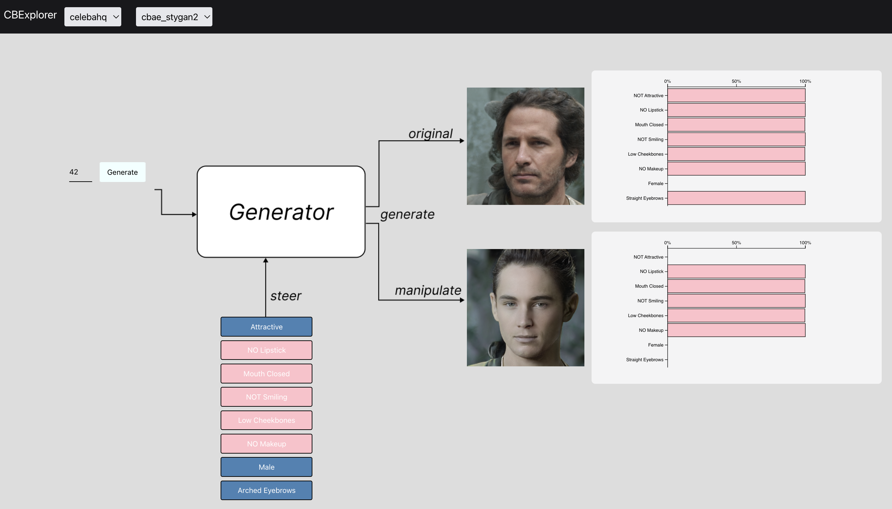

# CBExplorer
Implementation of Concept Bottleneck Explorer for ECS289H. CBExplorer is a visual demo of CB-AE and CC methods proposed in [_Interpretable Generative Models through Post-hoc Concept Bottlenecks_](https://arxiv.org/abs/2503.19377)


## Interface



# Run Backend 

- First, install dependencies.

    ```
    conda create -n posthocgencbm python=3.8
    conda install nvidia/label/cuda-11.7.0::cuda-nvcc cudatoolkit
    pip install torch==1.13.1+cu117 torchvision==0.14.1+cu117 torchaudio==0.13.1 --extra-index-url https://download.pytorch.org/whl/cu117
    pip install -r requirements.txt
    ```
- Then download checkpoints: 

    ```
    cd /CBExplorer/backend/posthoc_generative_cbm/models/
    mkdir checkpoints
    cd checkpoints
    gdown --fuzzy https://drive.google.com/file/d/15NPcmWmS3qqo95ezSh9LMnZvZuxpahea/view?usp=sharing
    unzip CE_checkpoints.zip
    ```

- Lastly, run the server by 

    ```
    cd /CBExplorer
    uvicorn backend.main:app --reload --host 0.0.0.0 --port 8000
    ```

# Run Frontend 


```
cd /CBExplorer/frontend
npm install
npm run dev
```